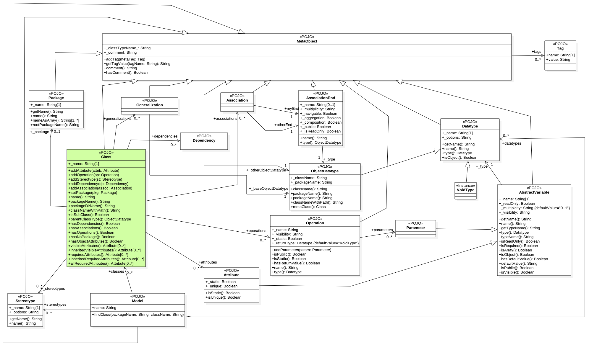

NodeMDA.js
==========

*NOTE: This README covers the NodeMDA code generation engine. 

For a free, open source, and completely integrated UML diagram creation tool with NodeMDA integrated, see the [NodeUML VSCode Extension](https://github.com/joelkoz/NodeUML)

If you are not interest in writing your own
code generation plugins and instead want to use NodeMDA to generate a complete NodeJS application stack
using Koa, Mongoose, and MongoDB for the back end and React + Mantine for the front end, all
deployable using Docker, see the README
for the [koa-react plugin](https://github.com/joelkoz/NodeMDA/tree/master/plugin-dev/koa-react) in the plugin-dev directory.


Introduction
------------

NodeMDA is a node.js library used for generating software source code for any project or language using a 
simplified version of the *Model Driven Architecture* methodology. By using a small subset of UML - 
*Class definitions and diagrams* - large sections of your application can be generated automatically. It
is particularly effective for the generation of backend artififacts like database entities and 
remote service interfaces.

NodeMDA is a code generation *_engine_* that uses "plugin" architecture driven
by [Handlebars templates](http://handlebarsjs.com/), allowing you to easily modify 
the code generator results to fit your needs.
While the NodeMDA engine and its plugins are written in Javascript and is executed
by Node.js, the resulting code does NOT need to be Javascript.  In fact, plugins can be created to generate artifacts for
any language or software stack.

NodeMDA focuses on generating code from UML *Class Diagrams*.  From this one diagram type, 
NodeMDA can create virtually all of the boilerplate code to get a 
backend system up and running, including database creation and client service interfaces. 


Workflow
------

The general workflow for using NodeMDA is as follows:

1. A *model* of your entity and service definitions are created using an external UML diagraming tool.

2. The model is processed using NodeMDA to generate source code and other project artifacts. In general, NodeMDA generates
all of the boilerplate code and stubs for things such as your services and persistence entities.

3. Where necessary, code stubs are filled in by hand to supply the business logic or add other functionality.

4. The resulting code is tested.  If additions or changes to the schemas or interfaces are required, the process returns to
step #1 where the *model* is modified and the entire cycle is repeated.


Usage
------

In order to use NodeMDA, a "reader" must exist to translate your model into 
NodeMDA's JSON based meta model.  If one can not be 
found, you will need to write one.  The current version of NodeMDA includes
a reader for [NodeUML](https://github.com/joelkoz/NodeUML).

There is also a reader for [StarUML](http://staruml.io/).

**_Command line_**
```

## The core NodeMDA system is best installed globally
npm install -g nodemda
npm install -g nodemda-nodeuml
npm install -g nodemda-koa-react
npm install -g nodemda-javascript-es6

## Create a new directory for your application

mkdir example-project

cd example-project

## Create and generate a project:

nodemda init

nodemda gen

## After the initial generation, install the dependencies

npm install

## You should now be able to:

npm test

npm start

```


Modeling Conventions
--------------------

Code generation by NodeMDA is currently based on three key UML artifacts: Classes, Datatypes, and Stereotypes. The general
strategy for creating your model is as follows:

1. Create one or more Class diagrams using your UML modeling tool of choice.

1. Add one or more classes to your diagram(s) based on your design.

1. Populate your classes with attributes and/or methods, making sure to specify a Datatype for
your attributes and method parameters.

1. Specify a "multiplicity" value on class Attributes and operation Parameters to indicate if the
value is optional or not. If the Multiplicity is not explicitly set, "0..1" is assumed, which translates
to an "optional value" for most plugins.  Attributes and parameters can be made "required" by
setting the lower limit of the multiplicity to one (e.g. "1" or "1..*").

1. Arrays can be modeled by specifying an upper limit of the multiplicity on an attribute or
parameter to a value that is greater than one (e.g. "0..*").

1. Specify a "Stereotype" for each class that you want to be processed by the code generator. Which
stereotype you specify will depend on what stereotypes are supported by the NodeMDA plugin you
are using.


For more details on how the above steps gets translated into code, see the "Plugins" section.


Supported UML Elements
------------------------
The JSON meta model used by NodeMDA to generate code currently supports the following UML elements:

* Package
* Datatype
* Stereotype
* Tag values
* Class
 * Attribute
 * Operation
 * Parameter
* Generalization
* Dependency
* Association
* Actor

Whether or not a particular element has any affect on code generation depends entirely on
the plugin being used. These elements do exist in the NodeMDA meta model, however, so if
there is an effect you desire, you can always modify or add a new template.


Advantages
----------
The beauty of the MDA approach is that it puts the burden of most of the coding details on the code generator.
This allows for error free performance and best of class configuration and functionality from the very beginning by
leveraging *knowledge capture*.  Ideally, plugins are written by expert developers who are experienced in a particular platform. 
This allows for subtle details to be captured and utilized by the code generator.  If enhancements or bug fixes are required to the 
generated code, a simple modification to the appropriate plugins are made, and all software artifacts can be quickly regenerated.


Another advantage of the MDA approach is that the *model* is platform agnostic. How the model is compiled into workable code depends 
on your selections from NodeMDA's plugin system.  Plugins can be written to generate code in any language or for any software stack.  
In fact, the SAME model can be used to generate workable code in a variety of languages and stacks, allowing you to quickly test and 
compare a variety of platforms before deciding on which one to use.


Finally a well designed plugin system can save a tremendous amount of development time by requiring you to only model software 
*concepts* and not specific language or platform constructs.  For example, by creating a single "Entity" class in your model, 
the code generator can create language specific objects to hold the entity data, a Data Access Object that allows you 
to use those other objects to interact with a backend database, 
and a database schema script that allows the entity to be created in the database itself.


Project goals
-------------
The inspriation for NodeMDA was taken primarily from the Java based open source project [AndroMDA](https://andromda.sourceforge.net).
NodeMDA aims to improve upon that project in the following ways:

1. Simplified usage via *[Convention over Configuration](https://en.wikipedia.org/wiki/Convention_over_configuration)*: 
By eliminating configuration files, both usage of the code generator as 
well as the development of plugins is greatly simplified, especially for the new user.

2. Streamlined plugin development: Javascript allows for existing objects to be extended
at runtime by simply declaring additional functions and properties, vs. having to extend,
compile, and package compiler artifacts as in Java.  Also, Javascript, being an an interpreted language, 
allows for much quicker development cycles vs. its Java counterpart as it eliminates the
compile step altogether. These are particularly important when it comes to plugin development for 
the source code generator. By combining Javascript and a much simpiler plugin architecture, 
the hope is more plugins will be developed by and for a wider audience.


Plugins
==================

NodeMDA generates its code using "plugins". A *plugin* is actually just a directory on your file
system that follows the NodeMDA *[Convention over Configuration](https://en.wikipedia.org/wiki/Convention_over_configuration)* 
rules, and is populated with [Handlebars](http://Handlebarsjs.com) templates and optional Javascript files 
that can be used to simplify template development.


Plugin Conventions
------------------

1. Plugins are organized by *platform*.  A *platform* is a particular software stack that the 
plugins are designed to generate code for. A plugin platform may be as generic as
"Javascript and SQL" or as specific as "Koa plus MongoDB back end and React plus Mantine for the front end".

1.  A plugin is an npm package that has the name "nodemda-<platformId>" where platformId is
a platform identifier that makes a valid module name.  The plugin package is expected to have a directory
named "plugins" that contains all of the templates and helper scripts.

2. All plugins are anywhere that is discoverable by the Node require system. The command "nodemda dirs" will
show you the exact locations of where NodeMDA is looking for its plugins in your project.

3. Inside the platform module's "plugins" directory lies zero or more "Stereotype" directories.  These directories
can contain zero or more Javascript files (which *must* end in `.js`) that are executed to aid in code generation, 
as well as zero or more Handlebar template files (which *must* end in `.hbs`). The directory name must 
match the name of the actual stereotype in both spelling and case.

4. Generated code will be placed in the directory specified by the property
`NodeMDA.Options.output` (default value is "."). Unless otherwise specified, generated
code will be placed in a sub-directory that matches the "UML package name" of the class, and
it will have a file name that is the "UML name" of the class.  The extension used for the
generated file will be the same as the template file, minus the ".hbs" extension.

5. Unless otherwise specified, each time NodeMDA is run, it will regenerate and overwrite 
output files with new ones.  This behavior can be changed by specifying an *output directive*
in the template (see the *Output Directives* section below).


A typical NodeMDA project directory structure thus may look like this:

```
+MyProject
 |
 +-model
 | |
 | +-MyProject.uml
 |
 +node_modules
  |
  +nodemda-javascript_sql
   |
   +-plugins
     |
     +-readme.txt.hbs
     |
     +-Entity
     | |
     | +-helpers.js
     | +-entity.js.hbs
     | +-schema.sql.hbs
     | +-json-schema.js.hbs
     |
     +-POJO
       |
       +-helpers.js
       +-pojo.js.hbs
       +-json-schema.js.hbs
```

Given the above, only a single platform is available for code generation (`javascript_sql`).  
There are template and scripts for that platform to
generate code for database classes marked with the `<<Entity>>` stereotype, as well as
generic Javascript objects marked with the `<<POJO>>` stereotype.

For every class in the model that is marked as an `<<Entity>>`, a Javascript file named
after the the class with an extension of ".js" will be created, along with a SQL schema
definition file named after the class with an extension of ".sql".  To aid the
Handlebars template engine in code generation, the `helpers.js` file will be executed,
calling various methods at each phase of code generation (see the *Template helper scripts*
section later for more details). 


Code generation algorithm
-------------------------
In a nutshell, NodeMDA passes each *class* that it finds in your model to every template in
every stereotype directory that the class is tagged with. Classes that have no stereotypes
are ignored. 

After all classes have been processed, NodeMDA checks for an executes any template files 
that exist in the platform's root directory. These template files are for "project wide" 
templates, and generally don't contain any class specific content (unless that content was 
generated earlier during the class run and saved for this final output phase). 

For example, assume you have three class files in your model:

* `<<Entity>>Data`
* `<<POJO>>Foo`
* `<<POJO>>Bar`

Assuming the directory structure specified above in the *Plugin Conventions* section,
the `Data` class will be passed and process by the Handlebar templates `Entity/entity.js.hbs`, 
`Entity/schema.sql.hbs`, and `json-schema.js.hbs`. These templates will be assisted by
the Javascript code found in `Entity/helpers.js`.
  
Both `Foo` and `Bar` will be
processed by the templates `POJO/pojo.js.hbs` and `POJO/json-schema.js.hbs`. Both
templates will be assisted by the Javascript code found in `POJO/helpers.js`

Once these three templates have been processed, the `javascript_sql/readme.txt.hbs` file
will be processed.


Template Context and Example
----------------------------

The Handlebars template engine expects a *context* object to exist that contains all of
the data to be used the templates. NodeMDA creates this context with the following data:

```
{
    class: new NodeMDA.Meta.Class(),
    output: "path/to/code/output/directory",
    model: {
              name: "Project name",
              datatypes: [ new NodeMDA.Meta.Datatype(), dt2, dt3... ],
              stereotypes: [ new NodeMDA.Meta.Stereotypes(), st2, st3... ],
              classes: [ new NodeMDA.Meta.Class(), c2, c3... ]
           }  
}
```

Properties:

* **_class_** A `NodeMDA.Meta.Class` object for the current class being processed.

* **_output_** The root output directory where generated code should be placed

* **_model_** The entire NodeMDA meta model for the project data model being processed


Here is a simple example of a template:

**pojo.js.hbs**
```
{{#with class}}
var {{name}} = {
   {{#each attributes}}
      {{name}} : "",
   {{/each}}
};
{{/with}}
```

It would generate code for a `Person` class that looks like this:

**Person.js**
```javascript
var Person = {
      firstName : "",
      lastName : "",
      birthDate : "",
};
```


Output Directive
-----------------

The default output behavior can be overridden on a template by template basis by specifying
an *output directive*. The directive must be placed in the template in such a way that
it will result in the first line of output starting with the `##output` prefix. That is,
it does *not* have to be the actual first line of the template, but anything that precedes
it must not result in any output.

An output directive has the following format:
```
##output <outputMode>[ <fileName>]
```

where *outputMode* is one of the following:

* __*overwrite*__ The file is overwritten each time NodeMDA is run.

* __*preserve*__ NodeMDA will not overwrite a preexisting file with the same name (usually
created by a previous run of NodeMDA).

* __*preserve!*__ Adding the exclamation point to the end of preserve ensures the file is preserved,
even if the "force overwrite" option has been specified.

* __*aggregate*__ The template output for each class will be gathered and placed in a single file of
the specified name.

* __*ignore*__ The template output is discarded and no output is saved. It is sometimes useful
for a template to render this option conditionally if it determines the output is not needed.

* __*property*__ The template output will be saved as an array property in the template context. 
The *fileName* specifier in this instance is the property name to use in the context. Each 
class' output will be an element in an array of strings. This is a special output specifier 
that can be used to place all of the output inside another template (usually a template in 
the platform's root directory, which is only processed once per NodeMDA run after all 
individual classes have been processed).

On all output modes except *property*, specifying the file name as the second paramter is optional.
The *property* output mode **_requires_** that a valid Javascript property name be specified 
as the second parameter.

For example, this is an explicit declaration of the otherwise default output behavior of a
.js.hbs file:
```
##output overwrite {{@root.output}}/{{class.package.name}}/{{class.name}}.js
```

as is this:
```
##output overwrite
```
 
 
Including template fragments
----------------------------

Template reuse is facilitated by Handlebars' *partials* system, which is Handlebars' equivalent of
an "include."  Template partials are automatically loaded by NodeMDA for all `.hbs` files that
it finds in the `_partials` subdirectory under the platform directory.  The name of the partial
will be the name of the file minus the `.hbs` extension.

In the example directory structure found under *Plugin Conventions*, the template `json-schema.js.hbs` 
was found in two separate directories. Placing the actual template code in both `.hbs` files
requires maintaining _two_ files each time an update is made to that template.
A better approach is to place the actual template code in
a single file and then "include" the contents via a *partial*.  For example:

**Directory structure**
```
+MyProject
 |
 +-model
 | |
 | +-MyProject.uml
 |
 +node_modules
  |
  +nodemda-javascript_sql
   |
   +-plugins
     |
     +-_partials
     | |
     | +-json-schema.hbs
     |
     +-Entity
     | |
     | +-json-schema.json.hbs
     |
     +-POJO
       |
       +-json-schema.json.hbs
```


**Contents of `json-schema.hbs`**
```
##output overwrite {{@root.output}}/{{class._package._name}}/{{class._name}}-schema.json
{
    "title": "{{class._name}}",
    "type": "object",
    ...
}
```


**Contents of the two `json-schema.js.hbs` files**
```
{{> json-schema}}
```


There is also a "global" directory located in the base plugin directory. A subdirectory named
`_partials` also exists there and is used to autoload partials that are global to all platforms.

**Directory structure**
```
+MyProject
 |
 +-plugins
   |
   +-global
     |
     +-_partials
       |
       +-myGlobalPartial.hbs
```


Custom Helper Tags
-----------------------

Handlebars allows for custom tag creation using a mechanism it calls *Helpers*.  NodeMDA 
includes a facility to auto load and register Handlebars helpers by using a mechanism similar
to the above *`_partials`* system. To register a helper, simply place a 
properly formatted `.js` file in the `_helpers` subdirectory underneath the platform directory.
This file should export a function that returns a string that is the output of the helper.
The name of the registered helper tag will be the name of the file (minus the .js extension).

__Contents of `_helpers/MyHelper.js`__
```
"use strict";

var helper = function() {
	return "Hello World!";
};

module.exports = helper;
```

**_Usage_**
```
{{MyHelper}}
```


As with *_partials*, helper scripts may also be registered by placing them in a
`_helpers` subdirectory underneath the `plugins/global` directory.


Template Support Scripts
-----------------------

The template engine can be enhanced by use of "support" scripts in the platform directories. These 
scripts can perform a variety of tasks, such as modifying or enhancing the
template context, as well as decorating the NodeMDA Meta data with additional code or data that can
simplify the templates themselves.


A support script file should follow this structure:
```javascript
"use strict";

var MySupport = {};

(function() {

    // All four methods specified here are OPTIONAL. A given support script may contain
    // all, none, or any combination of them.
    
	MySupport.initStereotype = function(context, stereotype) {
		// Called before the specified stereotype is used for
		// the first time.
	};

	
	MySupport.initClass = function(context, metaClass) {
		// Called just before the specified class is processed for the first time.
	};


	MySupport.initPlatform = function(context) {
	    // For scripts in the platform directory, this is called before 
	    // any classes have been processed.
	    // This function is ignored in scripts in a stereotype directory: use
	    // initStereotype() instead.
	    
	};
	
	
	MySupport.initProjectTemplates = function(context) {
	    // For scripts in the platform directory, this is called AFTER all 
	    // classes have been processed, but before any platform project templates 
	    // are processed.
	    // This function is ignored in scripts in a stereotype directory.
	};
	
	
})();

module.exports = MySupport;
```


Template Support Example
------------------------

The following Javascript support file is used to demonstrate how the NodeMDA meta classes can
be modified to make template authoring significantly easier. It demonstrates the user of NodeMDA's
simple "mixin" system that allows you to easily add functionality to the meta model. 

This file comes from a platform plugin that generates Javascript objects directly. It placed in 
the platfor directory of that plugin.

Note that the function in the specification is a "named function." This is critical to NodeMDA's
mixin specification. Basically, the code below says "add a getter property named 'jsIdentifierNAme'
to the Attribute meta model named.

```javascript
"use strict";

var NodeMDA = require("nodemda");

/*
 * Utility functions to make template generation much easier.
 */
var TemplateSupport = {};

(function() {


  TemplateSupport.initPlatform = function(context) {

    let model = context.model;

    model.mixin({

      onAttribute: {
        get: [
          /**
           * jsIdentifierName is the name to use as the identifier name
           * for an attribute in a class when generating Javascript code. 
           * The convention used is that read only and private variables are prefixed
           * with the "_" character.
           */
          function jsIdentifierName() {
            if (this.isReadOnly || !this.isPublic) {
              // A private variable...
              return "_" + this.name;
            }
            else {
              return this.name;
            }

            },
        ],
      },

    }); // end mixin

  };

  
})();

module.exports = TemplateSupport;

```

With the above, any of the code templates can use a simple output format like this:

```
{{attribute.jsIdentifierName}} = null;  
```

---
### Do you find my work useful?

<a href="https://www.buymeacoffee.com/joelkoz" target="_blank"></a>
---

NodeMDA Meta Model Reference
----------------------------

