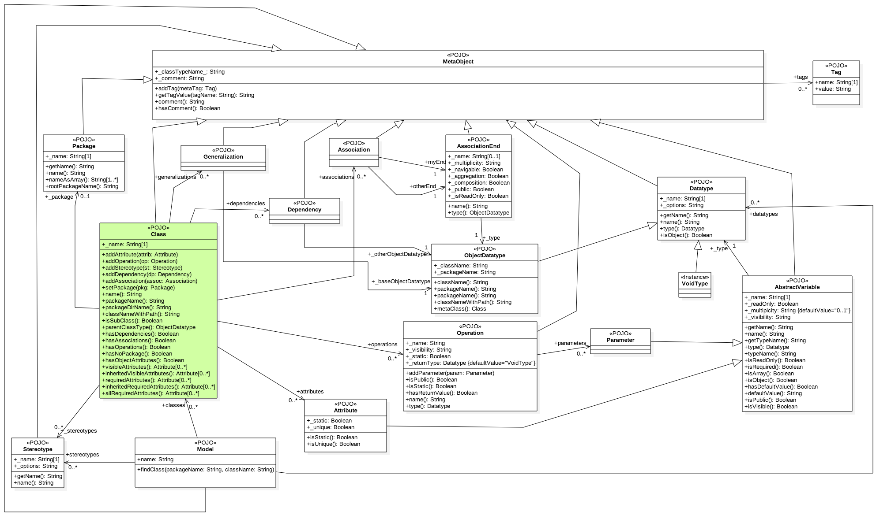

# NodeMDA 2.0

*NOTE: This README covers the NodeMDA code generation engine and how to create new plugin templates.

For a free, open source, and completely integrated UML diagram creation tool with NodeMDA integrated, see the [NodeUML VSCode Extension](https://github.com/joelkoz/NodeUML)


# Introduction

NodeMDA is a code generation engine written in NodeJS that accepts UML Class Diagrams as its input
then processes them using [Handlebars templates](https://handlebarsjs.com/guide/) to create code in any language. 
This documentation focuses on using the NodeMDA Command Line Interface to generate code, as well as how to create
new plugins.


## Project goals

1. Create an extensible code generator for any programming language or software stack

1. Use a capable template engine for code templates

1. Plugin system for code template selection

1. Support combining multiple plugins that each handle a differeent area of concern to simplify building
new software stacks. For example, one plugin may handle generating persistent entities, another may handle
the remote protocol (REST, SOAP, JSON RPC, etc.), a third may handle UI (web based, mobile, etc.). A single
software stack can be defined by combining these smaller parts, allowing for reusability and ease of development 
of new stacks. For example, you could write a plugin to handle a new UI technology and combine it with existing plugins
to handle backend code.

1. Simplified usage via *[Convention over Configuration](https://en.wikipedia.org/wiki/Convention_over_configuration)*: 
By eliminating as many configuration files as possible, development of plugins is greatly simplified

1. Streamlined template creation: Javascript allows for existing objects to be extended
at runtime by simply declaring additional functions and properties. NodeMDA supplies a mixin
API for adding new properties to the meta model making writing templates faster.


## Workflow

The general workflow for using NodeMDA is as follows:

1. An object graph of your software classes, known as the *model*, is created using an external UML diagraming tool. 
These classes are marked with certain stereotypes to indicate to NodeMDA what the classes represent (see 
[General Modeling Conventions](#general-modeling-conventions) below).

2. The model is processed using NodeMDA to generate source code and other project artifacts.

3. Where necessary, code stubs are filled in manually to supply the business logic or add other functionality. 

4. The resulting code is tested.  If additions or changes to your modeled classes are required, the process returns to
step #1 where the *model* is modified and the entire cycle is repeated. NodeMDA has a mechanism to ensure it does not 
overwrite certain files once you modify them.


# Usage

## Installation

In order to use NodeMDA, a "reader" must exist to translate your model into 
NodeMDA's Javascript based meta model.  If one can not be 
found, you will need to write one.  The current version of NodeMDA includes
a reader for [NodeUML](https://github.com/joelkoz/NodeUML).

There is also a reader for [StarUML](http://staruml.io/).

**_Command line_**
```

## The core NodeMDA system is best installed globally
npm install -g nodemda
npm install -g nodemda-nodeuml

## Install the plugins used to generate your desired software stack
npm install -g nodemda-stack-react-koa-mongo


## Create a new directory for your application

mkdir example-project

cd example-project


## Initialize a new project directory
nodemda init

## Here you would edit the UML file and create your software specifications

## Generate code with the code generator
nodemda gen

## After the initial generation, install the dependencies

npm install

## Follow the directions in the README of your plugins stack for details on how to test and run
```


## General Modeling Conventions

Code generation by NodeMDA is currently based on six key UML artifacts: 
  - Classes
  - Stereotypes
  - Associations
  - Actors
  - Dependencies
  - Tags


The general strategy for creating your model is:

1. Create one or more Class diagrams using a compatible UML modeling tool

1. Add one or more classes to your diagram(s) based on your design.

1. Populate your classes with attributes and/or operations, making sure to specify a Datatype for
your attributes and operation parameters.

1. Add a "Stereotype" to each class that you want to be processed by the code generator. Which
stereotype you specify will depend on the NodeMDA plugin you are using. Two of the most common are *Entity* and *Service*

1. Depending on the plugin stack you are using, you may also need to:
   - Add Associations between classes
   - Add dependencies to Actors to specify security roles
   - Add special Tag values to all of the above to fine tune code generation.

The specific modeling conventions to use will be dictated by the plugins you will use to generate code. Most 
plugins use the [NodeMDA Standards](../nodemdad-standards) modeling convention. See that plugin's README for details.


## Code Generation Process

Each time NodeMDA's `gen` function is run:

1. One or more plugins are discovered, traversed, and combined to form the set of templates and support files to be used.

2. A "reader" plugin reads the UML model file and creates the __*meta model object*__ using NodeMDA supplied Javascript classes

3. [Handlebars helpers](https://handlebarsjs.com/guide/#custom-helpers) are loaded from the `plugins/_helpers` directories

4. [Handlebars partials]() are loaded from the `plugins/_partials` directories

5. Template support scripts are loaded from the `plugins/_mixin` directories and `initPlatform()` is called on each (if defined)

6. Each class in the model that is marked with a stereotype is processed by all of the "stereotype specific" Handlebars templates

7. The method `initProjectTemplates()` is called on each template support scripts from the `plugins/_mixin` (if defined)

8. All of the Handlebars templates that are "project specific" (e.g NOT "stereotype specific) are then processed

9. Any file in the `plugins/templates` directory that is NOT a Handlebars script is assumed to be boilerplate and is copied verbatim to
the output directory.


# Plugins

A plugin in NodeMDA:

1. is a set of templates and support files used to generate a specific part of an application.
While a single plugin could generate an ENTIRE application, plugins are usually broken down into small 
subsystems, allowing them to be mixed and matched to generate code for a variety of software stacks.

1. is expected to export a *module definition object* that defines what the plugin does, and
   what it needs to perform its task.  Example:

   ### index.js
   ```
    module.exports = {
    	type: 'templates',
	    name: 'js-rest-koa',
	    desc: 'Generates REST interface to access persistent Javascript objects exposed with EntityDaoJS',
	    version: 2.0,
	    contributes: [ "REST", "Js-REST-Koa", "NodeJS-Backend" ],
	    requires: [	"EntityDaoJS", "NodeMDA-Standards" ]
    };   
   ```

1. can be one of three types:
   - templates
   - mixin
   - stack

1. is an npm package that is named __**nodemda-&lt;pluginName&gt;**__ where "pluginName" is the `name` property from its module definition object

1. contributes code by supplying it in the following directories inside its package:

```
  +-index.js
  |
  +-package.js
  |
  +-plugins
     |
     +-_helpers
     |   |
     |   +-camelCase.js
     |   +-outputIfEqual.js
     |
     +-_mixin
     |   |
     |   +-TemplateMixins.js
     |   +-DatatypeMixins.js
     |
     +-_partials
     |   |
     |   +-outputClassDef.hbs
     |
     +-templates
         |
         +-src
         |   |
         |   +-dataModels
         |       |
         |       +-{_package_}
         |           |
         |           +-{Entity}.js.hbs
         |           +-{Entity}-schema.sql.hbs
         |
         +-package.json.hbs
         +-README.md.hbs
```


## Module Definition Object

The properties within the module definition object exported by an individual plugin are:

- `type` Can be one of three values:

   - *templates* The plugin supplies templates in addition to optional mixin, partials, or helpers
   - *mixin* The plugin is purely code based and lacks a templates directory
   - *stack* The plugin defines a software stack. It has no `plugins` directory. Instead, the dependencies
             found in its `package.json` file are the other plugins that make up the software stack

- `name` The name of plugin WITHOUT the `nodemda-` prefix that makes up its package name

- `desc` A description of what the plugin does

- `version` The NodeMDA version it is compatible with. Should be `2.0`

- `contributes` An array of identifiers that specify what this plugin contributes to the software stack

- `requires` An array of identifiers that specify what this plugin needs to be contributed by other plugins to function.


## plugins Directory

The `plugins`directory of each plugins package is composed of zero or more of the following sub-directories:

- `_helpers` Contains zero or more .js files that each export a single Handlebars [helper](https://handlebarsjs.com/guide/#custom-helpers) function. The name of the file is used as the name of the helper when it is auto-registered with Handlebars. There is no need to call
   `Handlebars.registerHelper()`

- `_mixin` Contains zero or more .js files that exports a single "template support object". These usually utilize the
   `NodeMDA.Meta.Model.mixin()` function to quickly add addtional getters or functions to the meta model to ease in template generation.

- `_partials` Contains zero or more .hbs files that each contain a single Handlebars [partial](https://handlebarsjs.com/guide/partials.html#basic-partials) template fragment. The name of the file
   is used as the name of the partial when it is auto-registered with Handlebars. There is no need to call `Handlebars.registerPartial()`

- `templates` A list of zero or more files and/or subdirectories that make up the template files contributed by the plugin. If the file name
   ends in `.hbs`, it is considered a template file and is processed by NodeMDA and Handlebars. If the file does NOT end in `.hbs`, it is
   considered a boilerplate file and is copied verbatim to the output directory. 


## Template file names

All files located in the `templates` directory that end in `.hbs` will be processed by NodeMDA and Handlebars. How the template
file is named determines how and when the template is processed:

- If a file name contains a string surrounded by curly braces, then the string inside of the curly braces is assumed to be
  the name of a Stereotype.  The template will be processed once for each class in the UML model that is marked with that Stereotype.
  The name of the class will replace the name of the stereotype in the file name

- If the name does NOT contain the stereotype marker above, the template will be processed ONCE after all individual class specific
  template files are processed

In all cases, the resulting file name will have the `.hbs` extension removed, and it will be placed in a subdirectory that corresponds to
the template's location in the `templates` directory.

NodeMDA supports the use of a dynamic subdirectory name that is "UML package specific".  If the subdirectory name in the `templates`
directory is `{_package_}`, then that sub-directory name will be replaced with the actual package name of the class from the UML model.

### Example

Assume the plugin directory has the following layout:

```
  +-plugins
     |
     +-templates
         |
         +-src
         |   |
         |   +-dataModels
         |       |
         |       +-{_package_}
         |           |
         |           +-{Entity}.js.hbs
         |           +-{Entity}-schema.sql.hbs
         |
         +-package.json.hbs
         +-README.md.hbs
```

Also assume the UML model contains is a class named `Person` that has a stereotype of *&lt;&lt;Entity&gt;&gt;* and was defined
inside of the package `services/contacts`

NodeMDA will generate the following four files:

- `outputDir/src/dataModel/services/contacts/Person.js`
- `outputDir/src/dataModel/services/contacts/Person-schema.sql`
- `outputDir/package.json`
- `outputDir/README.md`


### Plural modifier

A stereotype specific template can use the `_s` suffix when specifying the stereotype to indicate you want the file to be named
with the plural representation of that class.  For example, if the above example used the file name `{Entity_s}-schema.sql.hbs`,
then the resulting file would have been

- `outputDir/src/dataModel/services/contacts/People-schema.sql`


## Template Context

The Handlebars template engine works by passing it an input object known as the [*context*](https://handlebarsjs.com/guide/expressions.html#basic-usage). Before each template is processed, NodeMDA prepares this *context* object with this set of properties:

```
{
    class: new NodeMDA.Meta.Class(),
    output: "path/to/code/output/directory",
    model: new NodeMDA.Meta.Model() 
}
```

### Template Context Properties
- **_class_**: The `NodeMDA.Meta.Class` object for the current class being processed.

- **_output_**: The root output directory where generated code should be placed

- **_model_**: The entire NodeMDA meta model for the project as read by the reader. The most interesting properties are:
    - **_name_**: The name of the project/model,
    - **_datatypes_**: an array of the NodeMDA.Meta.Datatype objects that appear in the model
    - **_stereotypes_**: an array of the NodeMDA.Meta.Stereotypes objects that appear in the model
    - **_classes_**: an array of the NodeMDA.Meta.Class objects that appear in the model
    - **_actors_**: an array of the NodeMDA.Meta.Actor objects that appear in the model


### Template file example:

**{POJO}.js.hbs**
```
{{#with class}}
var {{name}} = {
   {{#each attributes}}
      {{name}} : "",
   {{/each}}
};
{{/with}}
```

Above file would be applied to any class that has the `POJO` stereotype. For example, a class named __*&lt;&lt;POJO&gt;&gt;* Person__ would
result in this file:

**Person.js**
```javascript
var Person = {
      firstName : "",
      lastName : "",
      birthDate : "",
};
```


## Output Directive

By default, a template's output will be placed in output directory at the same path as it appears 
in the plugin relative to the `templates` directory (see [Template File Names](#template-file-names))
The default output behavior is to `overwrite` the file if it already exists.

The default output behavior can be overridden on a template by template basis by specifying
an *output directive*. This directive must be placed in the template in such a way that
it will result in the first line of output starting with the `##output` prefix. It does *not* have 
to be the actual first line of the template, but anything that precedes it must not result in any output.

An output directive has the following format:
```
##output <outputMode> [<fileName>]
```

where *outputMode* is one of the following:

* __*overwrite*__ The file is overwritten each time NodeMDA is run.

* __*preserve*__ NodeMDA will not overwrite a preexisting file with the same name (usually
created by a previous run of NodeMDA).

* __*preserve!*__ Adding the exclamation point to the end of preserve ensures the file is preserved,
even if the "force overwrite" option has been specified.

* __*aggregate*__ The template output for each class will be gathered and placed in a single file of
the specified name.

* __*ignore*__ The template output is discarded and no output is saved. It is sometimes useful
for a template to render this option conditionally if it determines the output is not needed.

* __*property*__ The template output will be saved as an array property in the Handlebars context. 
The *fileName* specifier in this instance is the property name to use in the context. Each 
class' output will be an element in an array of strings. This is a special output specifier 
that can be used to place all of the output inside another template (usually a template in 
the platform's root directory, which is only processed once per NodeMDA run after all 
individual classes have been processed).

On all output modes except *property*, specifying the file name as the second paramter is optional.
The *property* output mode **_requires_** that a valid Javascript property name be specified 
as the second parameter.
 
 

## Custom Partials

Template reuse is facilitated by [Handlebars' *partials*](https://handlebarsjs.com/guide/partials.html#basic-partials) 
system, which is Handlebars' equivalent of
an "include."  Template partials are automatically loaded by NodeMDA for all `.hbs` files that
it finds in the `plugins/_partials` directory.  NodeMDA has a convenient "auto-registration" system for
partials. All `.hbs` flies in the `_partials` directory are automatically pre-compiled and registered with 
Handlebars using the name of the template file (minus the `.hbs` extension). There is no need to call 
`Handlebars.registerPartial()` in any of your code.

### Example
Assume you had a need to generate a json schema in multiple templates in your plugin. Rather than 
repeat the template code in multiple places, complicating maintenance, you can define a partial
and then reference that in your various other templates.

**Contents of `plugins/_partials/json-schema.hbs`**
```text
{
    "title": "{{class._name}}",
    "type": "object",
    ...
}
```

**Contents of `plugins/templates/src/forms/{Entity}Editor.js.hbs` files**
```text
let {{class.jsIdentifierName}}Schema = {{> json-schema}};

// Rest of your code here...

```


## Custom Helper Tags


Handlebars allows for custom tag creation using a mechanism it calls [*Helpers*](https://handlebarsjs.com/guide/#custom-helpers). 
NodeMDA includes a facility to auto load and register Handlebars helpers by using a mechanism similar
to the above *`_partials`* system. To register a helper, simply place a 
properly formatted `.js` file in the `plugins/_helpers` directory.
This Javascript module should export a function that returns the value of the helper.
The name of the registered helper tag will be the name of the file (minus the .js extension). There is no need
to call `Handlebars.registerHelper`.

### Example
__Contents of `plugins/_helpers/lowercaseFirst.js`__
```javascript
export function(str) {
	if (str !== undefined && str !== null) {
        return str
           .replace(/^./, str => str.toLowerCase()); // Lower case the first letter        
    }	
    else {
    	return "";
    }
};
```

**_Usage_**
```text
let {{lowercaseFirst class.name}}Editor = new {{class.name}}Editor();
```


## Template Support Scripts

The template engine can be enhanced by use of "support" scripts located in the `plugins/_mixins` 
directory.  These scripts can perform a variety of tasks, such as modifying or enhancing the
template context, as well as using the `NodeMDA.Model.mixin()` function to decorate the meta data 
with additional code or data that can simplify the templates themselves.

A support script file should follow this structure:
```javascript
"use strict";

var MySupport = {};

(function() {

    // All five methods specified here are OPTIONAL. A given support script may contain
    // all, none, or any combination of them.
    

   /**
    * Called just after the model has been read into the metaModel.
    * Used to check the metaModel and ensure all modeling conventions
    * that are required by this plugin have been met.
    * 
    * @param {NodeMDA.Meta.Model} metaModel 
    * @returns {boolean} TRUE if the model passes validation, FALSE otherwise
    */
   MySupport.validateModel = function (metaModel) {
       return true;
   };


  /**
   * Called before the specified stereotype is used for
   * the first time.
   * 
   * @param {HandlebarsContext} context
   * @param {NodeMDA.Meta.Stereotype} stereotype
   */
   MySupport.initStereotype = function(context, stereotype) {

   };

	
  /**
   * Called just before the specified class is processed for the first time.
   * 
   * @param {HandlebarsContext} context
   * @param {NodeMDA.Meta.Class} metaClass
   */
   MySupport.initClass = function(context, metaClass) {
		// 
   };


  /**
	 * Called once after all partials and helpers have been loaded
   * and just before any classes are processed.
   * 
   * @param {HandlebarsContext} context
   */
   MySupport.initPlatform = function(context) {
	    
   };
	
	
  /**
	 * Called AFTER all classes have been processed, BUT BEFORE
   * any non sterotype specific templates are processed.
   * 
   * @param {HandlebarsContext} context
   */
   MySupport.initProjectTemplates = function(context) {
   };
	
})();

module.exports = MySupport;
```


## NodeMDA.Model.mixin()

NodeMDA provides a `mixin()` function to quickly add new properties and functions to the meta model. These
are designed to simplify templates by moving complex logic into Javascript functions vs. placing conditionals
or complex markup directly in the template file.

The `mixin()` function takes as a parameter the following **mixin specification**:

- An object with a set of properties, each named with the prefix "`on`" followed by the name of the UML meta element you wish to modify. 

- Each "`on`" property is an array of zero or more **mixin commands**. 

- Each **mixin command** is an object with the properties `get` and/or `func`
  - `get` adds "getters" to each instance of the specified "`on`" element
  - `func` adds functions that can be invoked to each instnace of the specified "`on`" element

- Each `get` or `func` is an array of **named functions** which are added to the element instances

- Arrays of single elements above can be abbreviated by using a single object rather than an array of a single object.


### Example

```javascript
"use strict";

const  NodeMDA = require("nodemda");
const pluralize = require('pluralize');

var TemplateSupport = {};

(function() {


  TemplateSupport.initPlatform = function(context) {

    let model = context.model;

    model.mixin({

      onAttribute: {
        get: [
					 function pluralName() {
					  	return pluralize(this.name);
					  },
        ],
      }

      onClass: {
        func: [
			    	function setUIProperty(name, value) {
			    		if (!this.hasOwnProperty('_uiProp')) {
			    			this._uiProp = {};
			    		}

			    		this._uiProp[name] = value;
			    	},          
        ],
      },

    }); // end mixin

  };
  
})();

module.exports = TemplateSupport;

```

With the above, any of the code templates can use a simple output format like this:

```text
{{attribute.pluralName}} = [];
```

Any other template support javascript code could do this:

```text
class.setUIProperty('hidden', true);
```


## NodeMDA Meta Model Reference

For details on meta model classes from the `NodeMDA.Meta` namespace, see the [meta source code](./src/meta/meta-model.js), or refer
to this diagram:
 



---
### Do you find my work useful?

<a href="https://www.buymeacoffee.com/joelkoz" target="_blank"></a>
---
